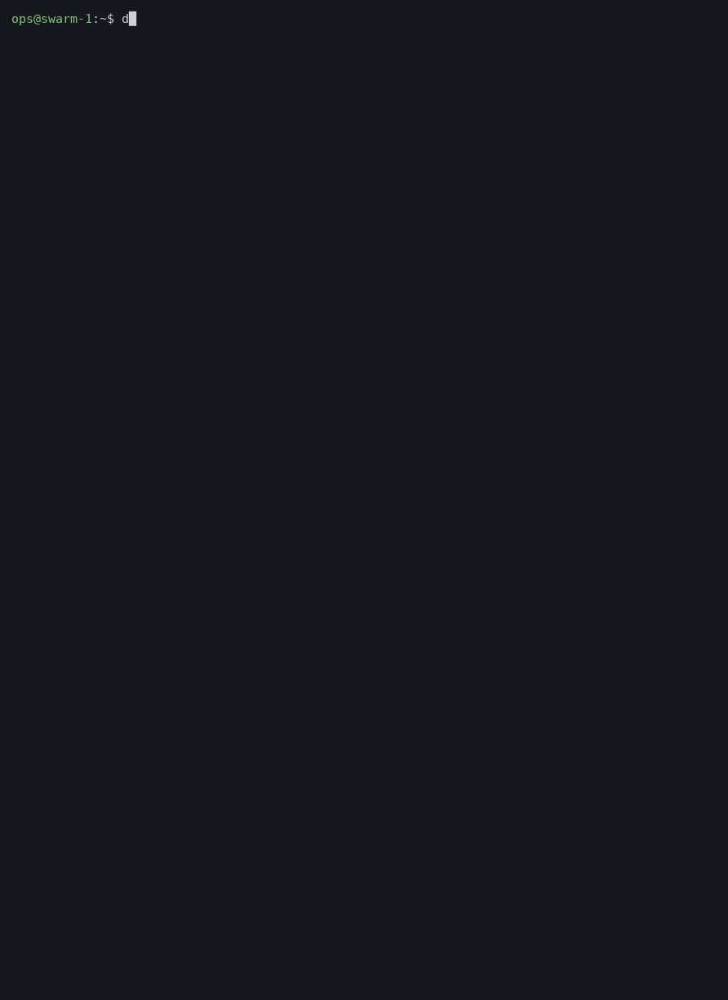

# dvt

**Docker and Swarm ops you can read, on servers that have no internet.**

`dvt` is one Python file tree you copy onto a server. It runs the docker
command you asked for and prints the answer as a width-fitted, colored table,
and it adds the few views an operator actually wants at 3am: what is broken,
what is in the logs, and what the host is doing right now. Nothing to install,
no agent, no daemon, no network access, no root.



## Why it exists

Swarm hosts behind a company firewall are still operated the way they were ten
years ago: `docker service ls` into an 80-column PuTTY window, columns wrapping
into each other, then `docker service ps <name> --no-trunc` to find out what the
error actually said, then `docker service logs` for each service in turn. The
graphical tools that fix this (Portainer, Swarmpit, Grafana) all want a
container, a port, a login and usually internet access, which is exactly what
these machines don't have.

`dvt` takes the other route: a single command on the server you are already
logged into.

```
$ dvt doctor
Swarm services: 4 healthy · 1 failing

✗ billing_report  0/1 replicas · registry.doublewave.uz/doublewave/billing/report:nonexistent-tag
  5 failed tasks in recent history · now: Rejected 3s ago
  ┌───────┬──────────┬────────┬───────┬────────────────────────────────────────────────┐
  │ TIMES │ STATE    │ LAST   │ NODES │ ERROR                                          │
  ├───────┼──────────┼────────┼───────┼────────────────────────────────────────────────┤
  │ 5×    │ Rejected │ 3s ago │ vm    │ failed to resolve reference "registry.         │
  │       │          │        │       │ doublewave.uz/doublewave/billing/report:       │
  │       │          │        │       │ nonexistent-tag": failed to do request: Head   │
  │       │          │        │       │ "https://registry.doublewave.uz/v2/doublewave/ │
  │       │          │        │       │ billing/report/manifests/nonexistent-tag":     │
  │       │          │        │       │ Forbidden                                      │
  └───────┴──────────┴────────┴───────┴────────────────────────────────────────────────┘
  → The image can't be pulled. Check the image name and tag, and that the node can
    log in to the registry (deploy with --with-registry-auth).
```

The same question answered with plain docker takes `service ls`, then
`service ps`, then reading a 400-character error line that PuTTY wrapped four
times.

## The three commands worth learning first

| Command | Answers |
|---|---|
| `dvt doctor` | Which services are failing, and why, with the repeated task errors grouped and a plain-language hint |
| `dvt errors` | What errors and warnings appeared in every service and container log in the last 30 minutes, grouped so 190 identical timeouts are one row |
| `dvt dash` | One screen: host, containers, services, disk, and what needs attention |

Everything else is plain docker, only readable:

```
$ dvt --short service ls
┌──────────────┬──────────────────┬────────────┬──────────┬───────────────────────┬────────────────┐
│ ID           │ NAME             │ MODE       │ REPLICAS │ IMAGE                 │ PORTS          │
├──────────────┼──────────────────┼────────────┼──────────┼───────────────────────┼────────────────┤
│ asp8ftlsjz63 │ billing_report   │ replicated │ 0/1      │ doublewave/billing/   │                │
│              │                  │            │          │ report:nonexistent-   │                │
│              │                  │            │          │ tag                   │                │
│ o2bhjctpc1ss │ traefik          │ replicated │ 1/1      │ doublewave/devops/    │ *:8080->80/tcp │
│              │                  │            │          │ registry/traefik:v3.  │                │
│              │                  │            │          │ 7.13                  │                │
│ qbrn32zkgop7 │ transfers_api    │ replicated │ 2/2      │ doublewave/transfers/ │ *:9000->80/tcp │
│              │                  │            │          │ api:testing-c5cbfead  │                │
└──────────────┴──────────────────┴────────────┴──────────┴───────────────────────┴────────────────┘
```

Red means a service is missing replicas, green means it is complete. Commands
that are not tables (`run`, `exec`, `build`, `logs -f`, typos...) are passed
through to docker untouched.

## Is it for you?

It fits if you keep Swarm or Compose stacks on Linux servers you reach over
SSH, especially ones with no internet access, and you read the output on a
terminal that is 80 to 120 columns wide.

It is also fine on a laptop with Docker Desktop or Podman, but there the
graphical tools are right there, so you will get less out of it.

* Repository: https://github.com/MaxMukhtarov/pprint-docker (branch `feature`)
* Version: 3.0.0b3 (until 2.4.1 this tool was called **pprint**; see
  [Switching from pprint](#switching-from-pprint))
* Needs: Python 3.7 or newer, and Docker 20.10 or newer or Podman 4 or newer. No other
  packages, no internet. Works on Linux, macOS and Windows (Docker Desktop).
* Install on a server with no internet: [method A](#a-from-the-source-archive-no-internet-needed-recommended-for-servers),
  one `tar -xzf` and a three-line launcher script.

---

## Manual

1. [Install](#1-install)
2. [Check that it works](#2-check-that-it-works)
3. [Quick start](#3-quick-start)
4. [Commands](#4-commands)
5. [Options](#5-options)
6. [Colors](#6-colors)
7. [Make plain `docker` use dvt](#7-make-plain-docker-use-dvt)
8. [Default options](#8-default-options)
9. [Update](#9-update)
10. [Uninstall](#10-uninstall)
11. [Troubleshooting](#11-troubleshooting)
12. [FAQ](#12-faq)
13. [Development](#13-development)

---

## 1. Install

Pick **one** of the methods below. Method A is the one to use on servers
without internet access.

Before you start, check Python:

```sh
python3 --version        # must be 3.7 or newer
```

### A. From the source archive, no internet needed (recommended for servers)

Copy `dvt-source.tar.gz` (or `dvt-source.zip`) to the server, then:

```sh
# 1. Unpack into your home folder. This creates ~/dvt
tar -xzf dvt-source.tar.gz -C ~
#   or, for the zip (no unzip command needed):
#   python3 -m zipfile -e dvt-source.zip ~

# 2. Create the `dvt` command
mkdir -p ~/bin
cat > ~/bin/dvt <<'EOF'
#!/bin/sh
PYTHONPATH="$HOME/dvt/src" exec python3 -m dvt "$@"
EOF
chmod +x ~/bin/dvt

# 3. Make sure ~/bin is on your PATH (already true on RHEL/CentOS)
echo "$PATH" | tr ':' '\n' | grep -qx "$HOME/bin" \
  || { echo 'export PATH="$HOME/bin:$PATH"' >> ~/.bashrc; export PATH="$HOME/bin:$PATH"; }
hash -r
```

To install it for **every user** on the machine, unpack it into `/opt`
and put the command in `/usr/local/bin` instead:

```sh
sudo tar -xzf dvt-source.tar.gz -C /opt
sudo tee /usr/local/bin/dvt >/dev/null <<'EOF'
#!/bin/sh
PYTHONPATH="/opt/dvt/src" exec python3 -m dvt "$@"
EOF
sudo chmod +x /usr/local/bin/dvt
```

### B. From GitHub (machines with access to GitHub)

```sh
git clone -b feature https://github.com/MaxMukhtarov/pprint-docker.git ~/dvt
```

Then do step 2 of method A to create the `~/bin/dvt` command.

### C. With pip

```sh
cd ~/dvt
python3 -m pip install --user .
```

This installs the `dvt` command into `~/.local/bin`. Make sure
`~/.local/bin` is on your PATH. (On PyPI the package is called
`dvt-docker`, because the name `dvt` belongs to another project.)

### D. As one single file

On a machine that has `make` and the source:

```sh
cd ~/dvt
make zipapp                      # builds dist/dvt
```

`dist/dvt` is a compressed archive of the code that Python runs
directly. Copy it anywhere, `chmod +x` it, and run it. You can't read the
code inside it, but `unzip -l dist/dvt` lists what it contains.

### Podman

dvt works with Podman the same way. If `docker` isn't installed and
`podman` is, dvt uses podman by itself. To choose explicitly, set
`DVT_ENGINE` or name the program:

```sh
export DVT_ENGINE=podman          # every dvt command uses podman
dvt podman ps                     # just this once
```

Everything works except what needs Docker Swarm, which Podman doesn't
have: `service`, `stack` and `node` commands, and `dvt doctor` (it says so
and exits). `dvt errors` reads container logs as usual.

### Docker Desktop (macOS and Windows)

Install Python 3.7 or newer, then use method B or C above. On Windows, run
the commands in PowerShell, and use `py -m pip install --user .` if
`python3` isn't found. Then:

```sh
dvt ps
```

Colors work in Windows Terminal and the Windows 10+ console. Where the
output can't show box lines and symbols (an old console, or output saved
to a file with a legacy code page), dvt draws them with `+ - |` instead.
To make plain `docker` use dvt in PowerShell, see section 7.

---

## 2. Check that it works

```sh
type dvt            # should point to ~/bin/dvt (or your chosen path)
dvt --version       # dvt 3.0.0b3
dvt ps              # your containers as a table
```

If you used **pprint** before, follow
[Switching from pprint](#switching-from-pprint) to remove the old command.

---

## 3. Quick start

```sh
dvt ps -a                          # all containers
dvt service ls                     # swarm services, replicas colored
dvt stats                          # live CPU/memory view, Ctrl+C to quit
dvt inspect <container>            # short summary of one container
dvt logs -f <container>            # colored logs
dvt dash                           # one-screen overview of the host
dvt images --group                 # one row per repository, with sizes
dvt clean --dry-run                # old unused image tags you could remove
dvt doctor                         # what is wrong with failing services
dvt errors                         # errors and warnings in all logs, last 30 minutes
dvt errors transfers --since 2d    # the same for one stack, service or container
```

The word `docker` is optional: `dvt ps -a` and `dvt docker ps -a`
are the same.

---

## 4. Commands

### 4.1 Tables

These docker commands are shown as tables:

| Area | Commands |
| --- | --- |
| Containers | `ps`, `container ls`, `top`, `stats` |
| Images | `images`, `image ls`, `history`, `image history`, `search` |
| Swarm | `service ls`, `service ps`, `node ls`, `node ps`, `stack ls`, `stack ps`, `stack services`, `secret ls`, `config ls` |
| Other | `volume ls`, `network ls`, `system df`, `context ls`, `plugin ls`, `buildx ls` |
| Compose | `compose ps`, `compose ls`, `compose images`, `compose top`, `compose stats` |

Examples:

```sh
dvt ps -a
dvt ps --filter status=exited
dvt images
dvt service ps api
dvt node ls
dvt system df
dvt compose -f docker-compose.prod.yml ps
```

What dvt does to tables:

* **Nothing is cut off.** For commands that support it, dvt asks
  docker for full values (`--no-trunc`) so COMMAND, ERROR and similar
  columns aren't shortened with `…`. Long values wrap inside their cell
  instead, breaking after `/ : - _ .` rather than mid-word. The one
  exception is COMMAND: a container started with a whole shell script in
  its command is cut to 60 characters, because otherwise it pushes every
  other column off the screen. `--full` prints it whole.
* **IDs stay short.** Full 64-character IDs and image digests
  (`@sha256:...`) are trimmed back to what docker normally shows.
* **Short columns keep their width.** CREATED, STATUS and PORTS never get
  squeezed. Only long columns such as IMAGE, COMMAND and NAMES wrap.
* **Ages are compact.** `4 minutes ago` becomes `4m ago` and
  `Up About an hour` becomes `Up 1h`. Use `--long-times` to keep the
  originals.
* **Empty cells stay empty.** A container with no ports shows an empty
  PORTS cell, and nothing shifts into the wrong column.

* **Images in use are marked.** In `images` and `image ls`, a green `●`
  before the name means at least one container (running or stopped) uses
  that image. A grey `○` means none does, so it's safe to remove. A legend
  is printed under the table.

  ```
  $ dvt --short images
  ┌────────────────────────────────────┬─────────────────────────────────────┬──────────────┬─────────┬────────┐
  │ REPOSITORY                         │ TAG                                 │ IMAGE ID     │ CREATED │ SIZE   │
  ├────────────────────────────────────┼─────────────────────────────────────┼──────────────┼─────────┼────────┤
  │ ● doublewave/transfers/api-v2      │ dev-e55edc11695bf0e572164ed49ea7a64 │ 3a4e72375f57 │ 32h ago │ 432MB  │
  │                                    │ 0b3a1b434                           │              │         │        │
  │ ○ doublewave/transfers/backoffice/ │ testing-49033ae06da069bca7aacb7ffef │ d8bcc442c9ec │ 2w ago  │ 80.1MB │
  │   ui                               │ 703cd0366dfe0                       │              │         │        │
  └────────────────────────────────────┴─────────────────────────────────────┴──────────────┴─────────┴────────┘
  ● used by a container   ○ not used
  ```

  To list only the unused ones: `dvt --grep ○ images`.

Example:

```
$ dvt --short --cols name,status,image ps -a
┌──────────────────────────────────────────┬───────────────────┬───────────────┐
│ NAMES                                    │ STATUS            │ IMAGE         │
├──────────────────────────────────────────┼───────────────────┼───────────────┤
│ sick                                     │ Up 7m (unhealthy) │ alpine        │   <- red
│ oneshot                                  │ Exited (1) 7m ago │ alpine        │   <- red
│ web                                      │ Up 7m (healthy)   │ alpine        │   <- green
└──────────────────────────────────────────┴───────────────────┴───────────────┘
```

### 4.2 Live stats

```sh
dvt stats                      # live view, refreshes every 2 seconds
dvt --sort cpu --desc stats    # busiest containers at the top
dvt -n 5 stats                 # refresh every 5 seconds
dvt --once stats               # print one snapshot and exit
```

Plain `docker stats` never exits, so dvt takes one sample at a time
(`--no-stream`) and redraws the screen in place, like `top`. Press
**Ctrl+C** to quit. When the output goes to a file or a pipe, dvt
prints a single snapshot instead.

### 4.3 Watch any table

```sh
dvt --watch service ls         # watch a deploy roll out
dvt --watch ps -a
dvt -w -n 1 service ps api     # every second
```

### 4.4 inspect

```sh
dvt inspect web                # summary of a container
dvt inspect web db cache       # several at once
dvt image inspect alpine       # summary of an image
dvt service inspect api        # summary of a swarm service
dvt --full inspect web         # every field, as a colored tree
```

The summary shows what you usually look for:

```
web  container
  ID              a60bbdb5f70a
  Image           alpine
  Status          running (healthy)
  Started         8m ago
  Restarts        0
  Restart policy  no
  Command         sleep 100000

Ports  (1)
  0.0.0.0:8080  → 80/tcp

Networks  (1)
  bridge  172.17.0.2

Environment  (1)
  PATH  /usr/local/sbin:/usr/local/bin:/usr/sbin:/usr/bin:/sbin:/bin
```

For an unhealthy container the summary also shows the output of the last
failed health check. Other objects (networks, volumes, nodes...) are shown
as a tree. Use `--format` to get docker's raw output, for example
`dvt inspect --format '{{.State.Status}}' web`.

### 4.5 Logs

```sh
dvt logs web                           # all logs, colored
dvt logs -f --tail 100 web             # follow, last 100 lines
dvt --grep error logs web              # only lines matching "error"
dvt --grep 'timeout|refused' logs -f api
dvt service logs -f api                # swarm service logs
dvt compose logs -f                    # compose logs, one color per service
```

* Lines with ERROR, FATAL, PANIC or FAIL are red, WARN lines are yellow,
  INFO is marked green and DEBUG/TRACE are dimmed. JSON logs
  (`"level":"error"`) and `level=warn` styles are recognised too.
* Leading timestamps are dimmed so the message stands out.
* The container's stderr is included, so error output isn't lost.
* `--grep` matches are highlighted.
* Ctrl+C stops following.

### 4.6 Dashboard

```sh
dvt dash               # one snapshot
dvt dash --watch       # live, refreshes every 2 seconds
dvt --short dash       # without registry hosts in image names
```

```
Docker 29.8.2 on vm · 4 CPUs · 15.7GiB RAM · swarm active
Containers: 5 running · 1 unhealthy · 1 failed

Needs attention (3)
  ✗ container sick: Up 8m (unhealthy)
  ✗ container oneshot: Exited (1) 8m ago
  ✗ service broken: 0/1 replicas running

Containers
┌─────────┬───────────────────┬────────┬───────┬─────────┬───────────────┐
│ NAME    │ STATUS            │ IMAGE  │ CPU % │ MEM     │ PORTS         │
...
Services
...
Disk
...
```

Problem containers are listed first. When nothing is wrong, the
"Needs attention" list is replaced by a green
"✓ Everything is running and healthy". The Services section only appears
on swarm managers.

### 4.7 Images grouped by repository

```sh
dvt images --group                 # one row per repository
dvt --short images --group         # without the registry host
dvt --grep backoffice images --group
```

Instead of one row per tag, you get one row per repository, biggest first:

```
┌───────────────────────┬──────┬──────────────────────┬────────┬────────┬────────────┬─────────────┐
│ REPOSITORY            │ TAGS │ NEWEST TAG           │ NEWEST │ IN USE │ TOTAL SIZE │ UNUSED SIZE │
├───────────────────────┼──────┼──────────────────────┼────────┼────────┼────────────┼─────────────┤
│ ● doublewave/         │ 4    │ dev-                 │ 1d ago │ 3 of 4 │ 1.75GB     │ 431MB       │
│                       │      │ e55edc11695bf0e57    │        │        │            │             │
│ transfers/api-v2      │      │ 2164ed49ea7a640b3a1b │        │        │            │             │
│                       │      │ 4                    │        │        │            │             │
│                       │      │ 34                   │        │        │            │             │
│ ● doublewave/         │ 4    │ testing-             │ 4h ago │ 1 of 4 │ 1.12GB     │ 843MB       │
│                       │      │ c5cbfead923c7        │        │        │            │             │
│ transfers/            │      │ ff776d60ec52225bff24 │        │        │            │             │
│                       │      │ 6                    │        │        │            │             │
│ backoffice/api        │      │ 9235ef               │        │        │            │             │
│ ● doublewave/devops/  │ 1    │ v3.7.13              │ 4w ago │ 1 of 1 │ 252MB      │             │
│   registry/traefik/   │      │                      │        │        │            │             │
│   traefik             │      │                      │        │        │            │             │
│ ● doublewave/         │ 2    │ testing-             │ 1d ago │ 1 of 2 │ 160MB      │ 80.1MB      │
│                       │      │ bd55266b6d414        │        │        │            │             │
│ transfers/            │      │ fb51488f2853f0266b69 │        │        │            │             │
│                       │      │ 0                    │        │        │            │             │
│ backoffice/ui         │      │ e37b8c               │        │        │            │             │
└───────────────────────┴──────┴──────────────────────┴────────┴────────┴────────────┴─────────────┘
● used by a container   ○ not used
11 images in 5 repositories, 3.28GB in total, 1.35GB not used
```

* **TAGS**: how many tags the repository has.
* **NEWEST TAG / NEWEST**: the most recently built tag and how old it is.
* **IN USE**: how many of those tags a container uses, running or stopped.
* **TOTAL SIZE / UNUSED SIZE**: an image with several tags is counted
  once. Images share layers, so the disk space you actually get back can
  be smaller than UNUSED SIZE.

`--group` can go before or after `images`. `--sort` and `--cols` work on
the grouped table too, for example `dvt --sort unused --desc images --group`.

### 4.8 Clean up old images: `dvt clean`

```sh
dvt clean --dry-run          # only show what would be deleted
dvt clean                    # show the plan, then ask before deleting
dvt clean --keep 2           # keep only the newest 2 tags per repository
dvt clean --keep 5           # keep the newest 5 tags per repository
dvt clean --grep api-v2      # only look at matching repositories
dvt clean --yes              # delete without asking (for cron jobs)
```

How dvt decides what to delete, per repository:

1. The newest **N** tags are always kept (`--keep N`, default **3**).
2. Any image used by a container, **running or stopped**, is always kept.
3. Every other tag is deleted. Unused dangling images (`<none>`) are
   deleted too.

It prints the plan first:

```
┌───────────────────────────┬────────────────────────────┬──────────────┬─────────┬───────┬────────┐
│ REPOSITORY                │ TAG                        │ IMAGE ID     │ CREATED │ SIZE  │ ACTION │
├───────────────────────────┼────────────────────────────┼──────────────┼─────────┼───────┼────────┤
│ ○ doublewave/transfers/   │ testing-42095844d514a1f1da │ 4bbfa42b6f2c │ 1w ago  │ 281MB │ delete │
│   backoffice/api          │ 0572dc0424de4f3b0484f0     │              │         │       │        │
│ ○ doublewave/transfers/   │ testing-9792faf89378ea4aae │ 44939f22ce0c │ 2w ago  │ 281MB │ delete │
│   backoffice/api          │ f1f336dd4bafcda106378c     │              │         │       │        │
│ ○ doublewave/transfers/   │ dev-f2241ba4d16b49ec25c17d │ 78cc88c49346 │ 2d ago  │ 431MB │ delete │
│   api-v2                  │ 42c92ff7fa1fa561f6         │              │         │       │        │
└───────────────────────────┴────────────────────────────┴──────────────┴─────────┴───────┴────────┘
3 images to delete in 2 repositories, up to 993MB freed  (keeping the newest 2 per repository and every image a container uses)
Delete these 3 images? [y/N]
```

* Nothing is deleted until you answer `y`. Any other answer, or Enter,
  cancels.
* `--dry-run` also lists the tags being kept and why, then stops.
* Without a terminal (in a script or cron job), dvt refuses to delete
  unless you pass `--yes`.
* Images are removed one at a time with `docker rmi repo:tag`, so one
  failure doesn't stop the rest. Each result is printed.
* Removing a tag whose image is also tagged elsewhere only removes that
  tag, and the image stays. The "freed" estimate accounts for that.
* Containers, volumes and networks are never touched. For those, use
  docker's own `docker container prune`, `docker volume prune` and
  `docker network prune`.

### 4.9 Swarm doctor: `dvt doctor`

```sh
dvt doctor                   # check every swarm service
dvt doctor --full            # list every failed task instead of grouping
dvt doctor --grep api        # only matching services
```

For each service that isn't healthy, you get the replicas, the current
state, the full error text grouped by message with a count, and a hint
about the likely cause:

```
Swarm services: 12 healthy · 1 restarting · 1 failing

✗ broken  0/1 replicas · alpine:nonexistent-tag
  5 failed tasks in recent history · now: Rejected 2s ago
  ┌───────┬──────────┬────────┬───────┬──────────────────────────────────────────────────────┐
  │ TIMES │ STATE    │ LAST   │ NODES │ ERROR                                                │
  ├───────┼──────────┼────────┼───────┼──────────────────────────────────────────────────────┤
  │ 5×    │ Rejected │ 2s ago │ vm    │ failed to resolve reference "docker.io/library/      │
  │       │          │        │       │ alpine:nonexistent-tag": not found                   │
  └───────┴──────────┴────────┴───────┴──────────────────────────────────────────────────────┘
  → The image can't be pulled. Check the image name and tag, and that the node can
    log in to the registry (deploy with --with-registry-auth).

! crashy  1/1 replicas · busybox:latest
  4 failed tasks in recent history · now: Running 10s ago
  ...
  → The program inside the container exited with an error. See why with
    `dvt errors crashy`.

✓ Healthy
┌──────────┬──────────┬──────────────────────────────┐
│ SERVICE  │ REPLICAS │ IMAGE                        │
...
```

* **✗ red**: fewer replicas are running than wanted.
* **! yellow**: all replicas are running, but tasks failed recently (a
  restart loop), or an update is paused or rolling back.
* **✓ green**: all replicas are running with no recent failures.

Hints cover the common causes: images that can't be pulled, non-zero
exits, exit 137 (out of memory or killed), no suitable node, ports already
in use, missing mounts and failing health checks.

Docker keeps only the last few tasks of each service (5 per replica by
default), so "failed tasks in recent history" counts those. `dvt doctor`
exits with code 1 when any service is failing, so it can be used in
scripts and monitoring checks.

### 4.10 Errors in logs: `dvt errors`

Reads the logs and tells you what is breaking: errors and warnings are
counted, and repeats of the same message are grouped, with how often it
happened and when it was first and last seen.

```sh
dvt errors                         # every service and container, last 30 minutes
dvt errors transfers               # one stack (all of its services)
dvt errors transfers_api           # one service
dvt errors payments                # one container, by name
dvt errors 9a8b7c --since 2d       # one container, by ID, last 2 days
dvt errors transfers payments      # several at once
dvt errors api --grep timeout      # count only lines matching a pattern
dvt errors --full                  # every kind of message, not just the top 10
```

Example:

```
$ dvt errors
Errors and warnings, last 30m: 7 errors · 1 warning in 2 of 5 sources
┌───────────────┬───────────┬────────┬──────────┬────────────┬───────┐
│ SOURCE        │ KIND      │ ERRORS │ WARNINGS │ LAST ERROR │ LINES │
├───────────────┼───────────┼────────┼──────────┼────────────┼───────┤
│ transfers_api │ service   │ 4      │ 1        │ 4m ago     │ 7     │
│ payments      │ container │ 3      │ 0        │ 4m ago     │ 5     │
└───────────────┴───────────┴────────┴──────────┴────────────┴───────┘
✓ nothing in quiet-box, traefik, transfers_worker

✗ transfers_api  service · 4 errors · 1 warning · 3 different messages
  ┌───────┬───────┬────────┬────────┬──────────────────────────────────────────────────────────┐
  │ COUNT │ LEVEL │ LAST   │ FIRST  │ MESSAGE                                                  │
  ├───────┼───────┼────────┼────────┼──────────────────────────────────────────────────────────┤
  │ 3×    │ error │ 4m ago │ 4m ago │ ERROR Timeout calling http://10.0.3.2:8080/accounts      │
  │       │       │        │        │ after 30000ms (order 9)                                  │
  │ 1×    │ error │ 4m ago │ 4m ago │ ERROR Npgsql.NpgsqlException: connection refused         │
  │ 1×    │ warn  │ 4m ago │ 4m ago │ WARN Retrying payment 5, attempt 2                       │
  └───────┴───────┴────────┴────────┴──────────────────────────────────────────────────────────┘

✗ payments  container · 3 errors · 2 different messages
  ┌───────┬───────┬────────┬────────┬──────────────────────────────────────────────────────────┐
  │ COUNT │ LEVEL │ LAST   │ FIRST  │ MESSAGE                                                  │
  ├───────┼───────┼────────┼────────┼──────────────────────────────────────────────────────────┤
  │ 2×    │ error │ 4m ago │ 4m ago │ fail: Payments.Api.Controllers[0] Unhandled exception    │
  │       │       │        │        │ for request 4f3a194-9c:                                  │
  │       │       │        │        │ System.InvalidOperationException: Sequence contains no   │
  │       │       │        │        │ elements                                                 │
  │ 1×    │ error │ 4m ago │ 4m ago │ System.TimeoutException: The operation has timed out     │
  └───────┴───────┴────────┴────────┴──────────────────────────────────────────────────────────┘
```

**What to pass.** Each name can be a stack, a service or a container, by
name or ID (an ID can be shortened, like docker allows). dvt works out
which it is. If a stack and a service have the same name, the stack wins.
With no name, it reads every swarm service plus every container that
isn't part of a service. A service's own task containers are skipped,
because the service logs already contain them.

**`--since`.** How far back to read: `30m` (the default), `6h`, `2d`, `1w`,
`1h30m`, or a date and time like `2026-10-07T09:00`. Days and weeks work
even though docker itself only understands hours.

**What counts as an error or warning.** Lines with a level word, such as
`ERROR`, `FATAL`, `CRITICAL`, `fail:` (.NET), `level=error` and
`"level":"error"`, and the same for `WARN`/`warning`. Lines without a level
that report an exception (`System.TimeoutException: ...`, a Python
`Traceback`, a Go `panic:`) count as errors too. The stack trace lines
below an error (`   at ...`) aren't counted separately.

**How repeats are grouped.** Numbers, IDs, IPs, hashes and timestamps are
ignored when comparing messages, so `Timeout calling 10.0.3.3 (order 3)` and
`Timeout calling 10.0.3.6 (order 6)` are the same problem. The table shows
the most recent example.

**In scripts and cron.** `dvt errors` exits with code 1 when it finds
any error, 0 when there are none (warnings alone give 0), and 2 when a
name doesn't exist or `--since` is invalid. For example:

```sh
dvt --no-color errors transfers --since 1h > /tmp/errors.txt || mail -s "transfers errors" ops@doublewave.uz < /tmp/errors.txt
```

Reading a long window over many containers can take a while, because
docker has to send all of those log lines. Narrow it with a name or a
shorter `--since`.

### 4.11 Everything else

Any command that isn't a table, logs or inspect runs exactly as if you'd
typed it without `dvt`. That includes `run`, `exec -it`, `build`,
`pull`, `events`, `login`, `--help` and typos. Their output, errors,
exit codes and Ctrl+C all behave normally.

```sh
dvt exec -it web sh      # works normally
dvt --raw ps             # force plain docker output for a table command
```

### 4.12 Non-docker commands

dvt also tries to format other column-aligned output, such as
`dvt kubectl get pods`. If the output isn't a table, it's printed
unchanged. dvt waits for these commands to finish, so only use it with
commands that end on their own.

---

## 5. Options

dvt's own options go **before** the command:
`dvt --sort cpu stats`, not `dvt stats --sort cpu`.
(Options after the command are passed to docker.)

### Table view

| Option | What it does | Example |
| --- | --- | --- |
| `--cols A,B,...` | Show only these columns, in this order. Names can be shortened or abbreviated (`cpu`, `mem`, `img`, `id`, `stat`). | `dvt --cols name,status,ports ps` |
| `--sort COL` | Sort rows by a column. Numbers, sizes (`512MiB`), percentages and ages sort by value. | `dvt --sort created images` |
| `--desc` | Sort largest first. | `dvt --sort cpu --desc stats` |
| `--grep REGEX` | Keep only rows (or log lines) matching, case-insensitive. | `dvt --grep api ps` |
| `--short` | Hide the registry host in image names (`registry.example.uz/team/api:v1` → `team/api:v1`), and drop the task ID from swarm container names (`api.1.rhl9m97o2vw5…` → `api.1`). | `dvt --short ps` |
| `--long-times` | Keep `4 minutes ago` instead of `4m ago`. | `dvt --long-times ps` |
| `--trunc` | Let docker truncate values as it normally does. | `dvt --trunc ps` |
| `--width N` | Table width in characters (default: the terminal width). | `dvt --width 120 ps` |

### Modes

| Option | What it does |
| --- | --- |
| `-w`, `--watch` | Redraw the output every few seconds until Ctrl+C. |
| `-n SEC`, `--interval SEC` | Seconds between redraws (default 2, minimum 0.5). |
| `--once` | `stats`: print one snapshot instead of the live view. |
| `--full` | `inspect`: show every field as a tree instead of the summary. On tables: print the whole COMMAND instead of the first 60 characters. |
| `--raw` | Run the command untouched. |
| `--group` | `images`: one row per repository with total and unused size. |

### dvt clean

| Option | What it does |
| --- | --- |
| `--keep N` | Keep the newest N tags of each repository (default 3). |
| `--dry-run` | Only show the plan, delete nothing. |
| `-y`, `--yes` | Delete without asking. |

`--grep` limits `clean` and `doctor` to matching repositories or services.
`--full` makes `doctor` list every failed task.

### dvt errors

| Option | What it does |
| --- | --- |
| `--since TIME` | How far back to read logs: `30m` (default), `6h`, `2d`, `1w`, or a date. |
| `--grep REGEX` | Count only log lines matching this. |
| `--full` | Show every kind of message for each source, not just the top 10. |

Unlike other commands, `dvt errors` accepts its options anywhere:
`dvt errors api --since 2d` and `dvt --since 2d errors api` are the same.

### Output

| Option | What it does |
| --- | --- |
| `--no-color` | Turn colors off. |
| `--color` | Force colors, even into a pipe (useful with `less -R`). |
| `-V`, `--version` | Show the version. |
| `-h`, `--help` | Show all options with examples. |

If an unknown column name is given, dvt lists the available ones:

```
$ dvt --cols bogus ps
dvt: no column matches 'bogus'. Columns: container id, image, command, created, status, ports, names
```

---

## 6. Colors

| Column | Green | Yellow | Red | Grey |
| --- | --- | --- | --- | --- |
| STATUS (containers) | Up, healthy | health: starting, restarting, paused | unhealthy, exited with a non-zero code, dead | exited (0), created |
| STATUS (nodes) | Ready | | Down, Unknown | |
| REPLICAS | all running (`2/2`) | some running (`1/3`) | none running (`0/1`) | |
| CURRENT STATE (`service ps`) | Running | Pending, Preparing, Starting | Failed, Rejected | Shutdown, Complete |
| AVAILABILITY | Active | Pause, Drain | | |
| CPU % / MEM % | | 50% or more | 80% or more | |
| ERROR | | | any error | |
| REPOSITORY / IMAGE (`images`) | `●` used by a container | | | `○` not used |

Names are bold, headers are bold and borders are dimmed.

Colors turn off automatically when the output isn't a terminal (a pipe
or a file), or when the `NO_COLOR` environment variable is set. Use
`--color` to force them on.

---

## 7. Make plain `docker` use dvt

If you'd like `docker ps` itself to be formatted, without typing
`dvt`:

```sh
# bash
echo 'eval "$(dvt shell-init bash)"' >> ~/.bashrc
# zsh
echo 'eval "$(dvt shell-init zsh)"' >> ~/.zshrc
# fish
echo 'dvt shell-init fish | source' >> ~/.config/fish/config.fish
```

```powershell
# PowerShell (Windows)
Add-Content $PROFILE 'Invoke-Expression (dvt shell-init powershell | Out-String)'
```

Then open a new terminal. This defines a small `docker` shell function:

* In your terminal, `docker ps` goes through dvt.
* In pipes and scripts (`docker ps | grep x`, `$(docker ps -q)`), docker's
  raw output is untouched, so nothing that parses docker output breaks.
* To skip dvt once, run `command docker ps`.

To see exactly what gets added, run `dvt shell-init bash`.

---

## 8. Default options

Put options you always want in the `DVT_OPTS` environment variable.
They're applied before the ones you type:

```sh
echo 'export DVT_OPTS="--short"' >> ~/.bashrc
```

`DVT_ENGINE` chooses the program dvt runs: `docker` (the default when it's
installed), `podman`, or a full path to either.

---

## 9. Update

| Installed with | Update by |
| --- | --- |
| A. source archive | Copy the new archive over, then `rm -rf ~/dvt && tar -xzf dvt-source.tar.gz -C ~`. The `~/bin/dvt` launcher stays as it is. |
| B. git | `cd ~/dvt && git pull` |
| C. pip | `cd ~/dvt && git pull && python3 -m pip install --user --upgrade .` |
| D. single file | Build a new `dist/dvt` and copy it over the old one. |

Check with `dvt --version`.

### Switching from pprint

Up to version 2.4.1 this tool was called `pprint`. From 3.0 it is `dvt`
everywhere, and the old name no longer works:

| Before | Now |
| --- | --- |
| `pprint ps`, `dpp ps` | `dvt ps` |
| `~/pprint` and the `~/bin/pprint` launcher | `~/dvt` and `~/bin/dvt` |
| `python3 -m pprint_docker` | `python3 -m dvt` |
| `PPRINT_OPTS="--short"` | `DVT_OPTS="--short"` |
| `eval "$(pprint shell-init bash)"` | `eval "$(dvt shell-init bash)"` |
| `pprint-source.tar.gz` | `dvt-source.tar.gz` |
| pip package `pprint-docker` | pip package `dvt-docker` |

On a server installed with method A:

```sh
# 1. Remove the old version
rm -f ~/bin/pprint
rm -rf ~/pprint

# 2. Install dvt: method A, steps 1 and 2 (unpack dvt-source.tar.gz, create ~/bin/dvt)

# 3. Rename the settings in your shell startup file, if you have them
sed -i 's/pprint shell-init/dvt shell-init/; s/PPRINT_OPTS/DVT_OPTS/' ~/.bashrc

# 4. Open a new terminal, then check
dvt --version
type pprint        # should say "not found"
```

All commands and options are the same as before; only the name changed.

---

## 10. Uninstall

1. **Remove the shell integration** if you added it (section 7). Delete the
   `dvt shell-init` line from `~/.bashrc`, `~/.zshrc` or
   `~/.config/fish/config.fish`, plus any `DVT_OPTS` line.

2. **Remove the program**, matching how you installed it:

   ```sh
   # A / B: source archive or git
   rm -f ~/bin/dvt
   rm -rf ~/dvt

   # A, installed for every user
   sudo rm -f /usr/local/bin/dvt
   sudo rm -rf /opt/dvt

   # C: pip
   python3 -m pip uninstall dvt-docker

   # D: single file
   rm -f ~/bin/dvt        # or wherever you copied it
   ```

3. Open a new terminal (or run `hash -r`) and check:

   ```sh
   type dvt               # should say "not found"
   ```

dvt doesn't change docker or any container, image or setting, and it
doesn't write any files of its own, so there's nothing else to clean up.

---

## 11. Troubleshooting

**`dvt: command not found`**
`~/bin` isn't on your PATH. Run `export PATH="$HOME/bin:$PATH"` and add
that line to `~/.bashrc`. Then run `hash -r`.

**`dvt --version` shows an old version, or the old behaviour**
An old alias or file is still in use. Run `type dvt`, then delete the
alias from `~/.bashrc` or the old file it points to, and open a new
terminal.

**`No module named dvt`**
The launcher can't find the source. Check that `~/dvt/src/dvt`
exists. If you unpacked it somewhere else, fix the path in `~/bin/dvt`.

**`SyntaxError` when starting**
Python is older than 3.7. Check with `python3 --version`.

**`Cannot connect to the Docker daemon`**
That message comes from docker itself. Check that `docker ps` works
without dvt (permissions, `sudo`, or the `docker` group).

**No colors**
The output isn't going to a terminal, or `NO_COLOR` is set. Use `--color`
to force them.

**The table is too wide or wraps too much**
dvt uses the terminal width. Make the window wider, use `--cols` to
show fewer columns, use `--short` for image names, or set `--width`.

**The live view shows "… N more lines"**
The window isn't tall enough. Make it taller, or narrow the list with
`--grep` or `--cols`.

**A command hangs**
Docker commands that stream (`logs -f`, `events`, `stats`) are handled by
dvt and stop with Ctrl+C. A non-docker command that never finishes
will hang, because dvt waits for its output. Use `--raw` for those.

**`dvt errors` shows "! name: Error response from daemon: ... does not support reading"**
That container or service uses a logging driver docker can't read back
(for example `syslog` or `gelf` without dual logging). Its logs live in
that system instead, so dvt can't count them.

**`dvt errors` says "no stack, service or container called ..."**
Check the name with `dvt service ls`, `dvt stack ls` or
`dvt ps -a`. Stacks and services are only visible on a swarm manager.

**`--sort` or `--cols` passed to docker by mistake**
dvt's options must come before the command: `dvt --sort cpu stats`.

---

## 12. FAQ

**Does dvt change anything in docker?**
Only `dvt clean` deletes anything, and only image tags, after you
confirm. Everything else just runs the docker command you give it,
sometimes adding read-only display flags (`--no-trunc`, `--no-stream`),
and reformats the output.

**Can `dvt clean` delete an image a service needs?**
Not one that any container uses, running or stopped. But a service that
is scaled to 0, or a tag you plan to deploy later, has no container. If
you need such a tag, raise `--keep`, or check with `--dry-run` first.

**Is it safe in scripts?**
Scripts should call `docker` directly, or use `dvt --raw`. With the
shell integration from section 7, `docker` in pipes and scripts already
gets docker's raw output.

**Does it work with old docker versions?**
Yes. dvt asks docker for JSON where it can, which is exact even when
values contain spaces or cells are empty. If docker doesn't understand the
request, dvt quietly reads the normal text output instead.

**Can I still use `--format`?**
Yes. `dvt ps --format '{{.Names}}'` is passed straight through.
`--format 'table ...'` output is still formatted as a table.

**`dvt ps` runs docker, but I wanted Linux `ps`.**
dvt treats `ps` and `top` as docker commands. Use the full path for the
Linux tools: `dvt /bin/ps aux`.

**Why the name dvt?**
It's short to type and doesn't collide with the `pprint` module that comes
with Python, which the old name did.

**Does it need internet?**
No. It only needs Python 3.7+ and the docker (or podman) CLI.

---

## 13. Development

### Project layout

```
dvt/
├── README.md
├── pyproject.toml          package metadata, the `dvt` command
├── Makefile                test / build / zipapp shortcuts
├── src/dvt/
│   ├── __main__.py         `python3 -m dvt` starts here
│   ├── cli.py              options and dispatch to the right feature
│   ├── docker.py           which docker command is it; flags to add
│   ├── engine.py           docker or podman: which program to run
│   ├── table.py            Table model; parsing column-aligned output
│   ├── formats.py          reading list commands as JSON (with text fallback)
│   ├── layout.py           column widths, wrapping, drawing the box
│   ├── transform.py        short IDs/ages/images, --cols, --sort, --grep
│   ├── styles.py           which cell gets which color
│   ├── ansi.py             color codes; measuring text without them
│   ├── runner.py           running commands (captured or attached)
│   ├── options.py          settings shared by all features
│   ├── units.py            sizes and times: parsing and printing
│   └── features/
│       ├── tables.py       list commands as tables
│       ├── live.py         full-screen redraw (stats, --watch, dash --watch)
│       ├── logs.py         colored logs and --grep
│       ├── inspect.py      inspect summaries and JSON tree
│       ├── dashboard.py    dvt dash
│       ├── images.py       in-use marks, image data, images --group
│       ├── clean.py        dvt clean
│       ├── doctor.py       dvt doctor
│       ├── errors.py       dvt errors
│       └── shell.py        dvt shell-init
├── .github/workflows/
│   └── tests.yml           CI: unit tests per Python, real tests per Docker
└── tests/
    ├── fixtures/           real docker output recorded for the tests
    ├── fake_docker.py      stand-in docker used by the end-to-end tests
    ├── real/               tests against a real docker daemon (REAL_DOCKER=1)
    └── test_*.py
```

### How a command flows

1. `cli.py` reads dvt's options and adds `docker` in front if you left
   it out.
2. `docker.py` classifies the command as table, stats, logs, inspect or
   passthrough.
3. Passthrough commands run attached to your terminal, untouched.
4. Table commands run with their output captured. For `ps`, `images`,
   `service ls`/`ps`, `stack ps`, `node ls`/`ps` and `stats`, `formats.py`
   asks docker for one JSON object per row (a `--format` template naming
   each field) and builds the table with docker's own headers. Every other
   table command, and a docker too old for the template, goes through
   `table.py`, which finds the column boundaries from the header
   positions. Then `transform.py` shortens, filters and sorts, and
   `layout.py` draws the table with colors from `styles.py`.

### Run from source without installing

```sh
cd ~/dvt
PYTHONPATH=src python3 -m dvt ps
```

### Tests

```sh
python3 -m pip install pytest      # once
make test                          # or: PYTHONPATH=src python3 -m pytest -q
```

The tests use recorded docker output and a fake `docker`, so they run
without a docker daemon.

`tests/real` runs the whole tool against a real docker daemon instead. It
checks that every table read as JSON matches docker's own text output, and
that every command (tables, stats, inspect, logs, dash, doctor, errors,
clean) works end to end:

```sh
docker pull busybox:latest          # once; or `docker load` it offline
make test-real                      # or: REAL_DOCKER=1 python3 -m pytest -v tests/real
```

It creates a swarm if the machine isn't in one, plus a stack, services
and containers named `rt_*`, and removes them afterwards. Run it on a test
machine, not on a production node.

For Podman, run it with `DVT_ENGINE=podman make test-real`; the swarm
parts are skipped.

Tested with Docker 20.10, 24, 27 and 29, Podman 4.9, and Python 3.7 to
3.13. GitHub Actions (`.github/workflows/tests.yml`) runs on every push:
the unit tests on each Python version and on macOS and Windows, and
`tests/real` against each Docker version and against Podman.

### Build

```sh
make zipapp        # dist/dvt, one executable file
make build         # wheel + sdist in dist/ (needs: pip install build)
make clean         # remove build output
```

### Adding a new table command

Add it to `TABLE_COMMANDS` in `src/dvt/docker.py`. If docker
supports `--no-trunc` for it, add it to `NO_TRUNC` as well. To read it as
JSON, add its columns (header and `--format` field) to `LAYOUTS` in
`formats.py` and a JSON fixture to `tests/fixtures`. To color a new
column, add a rule in `styles.py`. Add a test in `tests/test_docker.py`.
